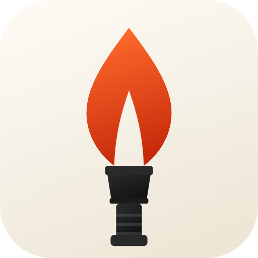

<div align="center">



# TorchLight

**The internet was built for everyone.**
<p><b>Reclaim it.</b></p>

[](https://github.com/junwonkim07/TorchLight)
[](https://flutter.dev)
[](LICENSE.md)
[](https://github.com/junwonkim07/TorchLight/releases)

</div>

---

## TorchLight란?

TorchLight는 인터넷 검열 국가 사용자를 위해 설계된 VPN 클라이언트 입니다. 방화벽을 뚫고, dpi 패킷 검사를 피할 수 있으며, 인터넷 사용에 제한이 없도록 합니다.

최신 검열 우회 프로토콜을 지원하는 [Sing-box](https://github.com/SagerNet/sing-box)를 기반으로 설계되었으며, 인터넷 사용이 가장 제한적인 환경에서도 작동합니다.

---

## Features

- **Multi-protocol 지원** — VLESS, REALITY, VMess, Trojan, Hysteria2, Shadowsocks, WireGuard 등
- **자동 프로토콜 변경 기능** — 네트워크 환경에 가장 잘 맞는 프로토콜을 자동으로 선택해줍니다
- **구독 링크 지원** — 프록시 구독 링크를 지원합니다
- **비상업적 용도** — 무광고, 무추적, 무로그를 원칙으로 합니다
- **Open source** — 희망 사항이 있다면 오픈소스 커뮤니티에 기여할 수 있습니다

---

## 지원 플랫폼

| 플랫폼     | 상태            |
|---------|---------------|
| Android | ✅ Supported   |
| iOS     | ✅ Supported   |
| Windows | 🔜 Coming soon |
| macOS   | 🔜 Coming soon |

---

## 시작하기

### Prerequisites

- [Flutter SDK](https://flutter.dev/docs/get-started/install) 3.x
- [Android Studio](https://developer.android.com/studio) Flutter & Dart plugins도 필요
- [Go](https://go.dev/dl/) (Sing-box core 빌드용)
- Android NDK (Android Studio SDK Manager)

### 설치

```bash
# Clone the repository
git clone https://github.com/junwonkim07/TorchLight
cd TorchLight

# Initialize submodules (includes Sing-box core)
git submodule update --init --recursive

# Install Flutter dependencies
flutter pub get

# Run on connected device
flutter run
```

### APK 빌드

```bash
flutter build apk --release
```

---

## 서버 설정하는 법

1. TorchLight 열기
2. **Add Profile** 누르기
3. 구독 URL 붙여넣기 or QR코드 스캔하기
4. **Connect** 누르기

---

## Protocol 지원 목록

| Protocol | Description                  |
|----------|------------------------------|
| VLESS + REALITY | 가장 우회 잘됨. 러시아, 중국등지에서 사용 권장  |
| Hysteria2 | 불안정한 네트워크에서 사용 권장 (QUIC/UDP) |
| Trojan | HTTPS 위장, CDN 친화적            |
| Shadowsocks 2022 | 호환성 우선시                      |
| VMess | 레거시 지원                       |
| WireGuard | 터널링 필요시 권장                   |

---

## 기여
언제든지 환영합니다. 기여하고 싶다면 아래 분야들을 집중해주세요:

- Flutter / Dart development
- iOS (Swift)
- Android (Kotlin)
- Translations

Pull Request를 제출 하기 전에 [CONTRIBUTING.md](CONTRIBUTING.md) 를 참고해주세요.

---

## 라이센스

TorchLight는 [MIT License](LICENSE.md)를 따릅니다.
